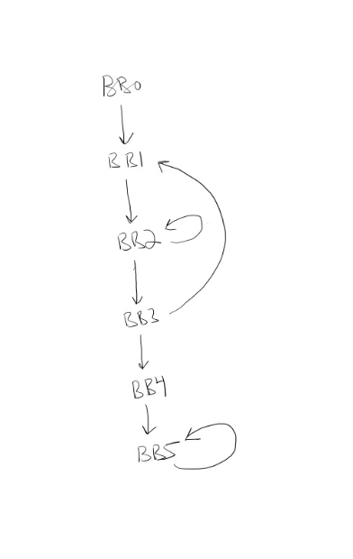

# Basic Blocks
In order to generate efficient code, it is helpful to break the program into maximally large segments which must always be 
evaluated sequentially, such a segment of three address code is called a basic block. 

A **basic block** is a subsequence of the three address code for a program in which there are no jumps (conditional or absolute) except possibly
the last instruction, and there are no labels except possibly for the first instruction. So any time the processor starts executing
the first instruction it will run all of the instruction in order until the last instruction.

## Example 
Consider the following example from the suggested textbook Aho,Sethi,Ullman, ... Example 8.6.
The following code initializes a 10x10 array to have zeroes everywhere except having ones on the diagonal. We assume that a 2 dimensional array a[i][j] is compiled into a 1 dimensional array where
```
a[i][j] = A[N*i + j]
``` where N is the width of each row of the array.

This code initializes the array to be the identity matrix:
``` java
for (int i=0; i<10; i++)
  for (int j=0; j<10; j++)
    a[i][j] = 0;  // A[10*i+j] = 0
for (int i=0; i<10; i++)
  a[i][i]=1;      // A[10*i+j] = 1
```
We can convert this into the following three address code
which decomposes into 5 basic blocks...
{: style="float: left"}
```
  i = 0                # BB0

L1:                    # BB1
  j = 0

L2:                    # BB2
  t1 = 10 * i
  t2 = t1 + j
  a[t2] = 0
  j = j + 1
  if j <= 10 goto L2:

  i = i + 1            # BB3
  if i <= 10 goto L1:

  i = 0                # BB4

L3:                    # BB5
  t5 = 10 * i
  t6 = t5 + i
  a[t6] = 1
  i = i + 1
  if i <= 10 goto L3:  
```

We can represent this program as a directed graph where the nodes are the basic blocks
and there is an edge from one node to another if control can pass directly between those two
blocks. Here is the flow graph for this program:


