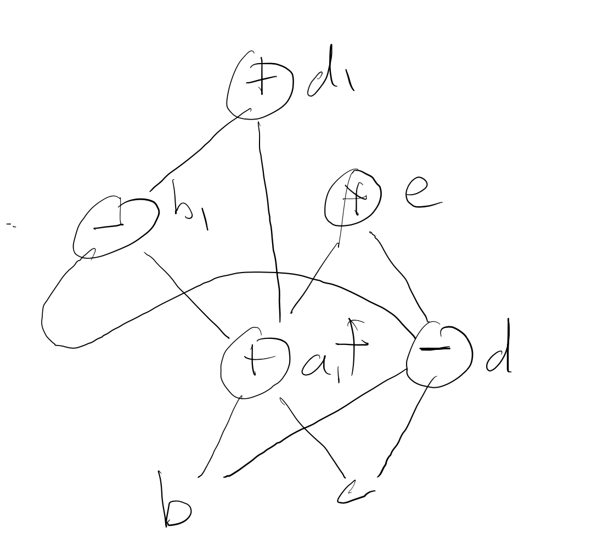

# DAG representation of Basic Blocks
One very useful way to optimize basic blocks is to represent them as Directed Acyclic Graphs
in a way that allows one to easily find common subexpressions and to eliminate dead code.

We'll give some examples on this page...

Consider the following basic block
```
a = b + c
d = b - c
e = a * d
f = b + c
b = d - a
d = f + b
```
We first renumber the variables with indices representing whether the number of times their value has changed:
```
a = b + c
d = b - c
e = a * d
f = b + c
b1 = d - a
d1 = f + b1
```

Then we create a DAG where the leaves are the original variables



And we can then compile this basic block back into three address code in a way that
eliminates the duplicate computation of ```b+c``` and also introduce instruction level parallelism
that a super scalar processor can exploit:
```
a = b + c  ;   d = b - c  #  these can be run in the same cycle
b = d - a  ;   e = a * d ; f = a #  same cycle
d = b + a
```
So this reduces the number of cycles (aka latency) from 6 to 3 and eliminates the recomputation of ```b+c```

## Practice
Let's have you practice optimizing the following code:
```
a = b + c
d = c - a
e = b + c
b = e + d
f = b + c
a = f - e
```


