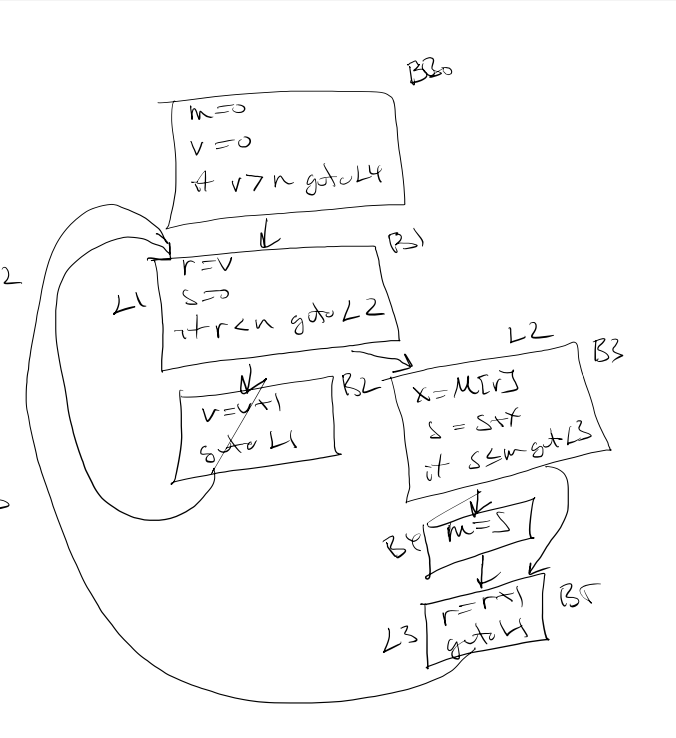

# Liveness Analysis for Flow Graphs

One of the most important kinds of analysis that a compiler needs to perform is determining, at each point in a program
which variables are live and which are dead.  

Let A = B OP C be an instruction, then we say that A is defined by that instruction and B and C are used.

A variable is (statically) live at a point, if there is a path from that point to a use of that variable, 
which doesn't pass through a definition of that variable, in other words, the value of that variable at that point
might be needed by a later instruction.  

If there are no such paths, then we say the variable is (statically) dead, that is, if every path from that point
eventually reaches the end of the program or reaches an instruction that redefines the variable.

We've already seen how to do liveness analysis for basic blocks. For flowgraphs we need a more sophisticated approach.

The idea is to try to determine at the beginning of each block the set of variables which are live.

Let L(B) be the set of variables which are live at the end of block B. We have seen how to use that information
to find the set T(L(B)) of variables which are live at the start of block B.

We start by assuming that L(B) is empty for each block and we will define a set of equations that propogate the uses of each variable throught the flow graph. When the equations stabilize we have a solution to our liveness analysis.

So for each block B we iterate the following equations and keep doing this until there are no changes

$L(B) = \bigcup_{C\in S(B)} T(L(C))$

where $S(B)$ is the set of all blocks that directly follow block $B$.

Another way to write this is with 
* $in(B)$ the variables which are live at the begining of the block B
* $out(B)$ the variables which are live at the end of the block B

The the flow equations become:

${\rm in}(B) = T({\rm out}(B))$

${\rm out}(B) = \bigcup{C \in S(B)} {\rm in}(B)$


We can define $T(V)$ as follows:

$T(V) = V - {\rm def}(B) \cup {\rm use}(B)$

where 
* ${\rm use}(B)$ are the variables in B that are used in B before being defined in D and
* ${\rm def}(B)$ are the variables in B that are defined before being used

Let's try this with a simple example program, where I have introduced labels for each basic block
whether or not there is a jump to it.
```
B0:
  m=0
  v=0
  if v>n goto B6
B1:
  r=v
  s=0
  if r<n goto B3
B2:
  v=v+1
  goto B1
B3:
  x=M[r]
  s=s+x
  if s<=m goto B5
B4: 
  m=s
B5: 
  r=r+1
  goto B1
B6:
  return m
```
or in graph form:


The successor function on basic blocks is then
```
S(B0) = B1, B6
S(B1) = B2, B3
S(B2) = B1
S(B3) = B4, B5
S(B4) = B5
S(B5) = B1
S(B6) = emptyset
```
and we can calculate the use/def sets for the basic blocks.
Complete the following table ...

| B | use(B) | def(B) | equation |
| --- | --- | --- | --- |
| B0 | n | m v | $in(B_0) = out(B_0) \cup \\{n\\} - \\{m,v\\}$|
| B1 | v n| r s | $in(B_1) = out(B_1) \cup \\{n\\} - \\{s\\}$|
| B2 | | | |
| B3 | | | |
| B4 | | | |
| B5 | | | |
| B6 | m | $\\{\\}$ | |

We can now calculate the Flow equations

$L(B0) = T(L(B1)) \cup T(L(B6))$

$T(L(B1)) = L(B1) \cup {\rm use}(B1) - {\rm def}(B1) = L(B1) \cup \\{r,n\\} - \\{r,s\\} = L(B1) \cup \\{r\\} - \\{s\\}$

$T(L(B6)) = L(B6) \cup {\rm use}(B6) - {\rm def}(B6) = L(B6) \cup \\{m\\} - \\{\\}= L(B6) \cup \\{m\\}$

$L(B1) = T(L(B2)) \cup T(L(B3))$

you can complete these formulas for B1, B2, B3, B4, B5, B6.

Starting off with $L(B)=\\{\\}$ for all B and iterating until there is no change we will calculate the variables which are live at the end of each block. From there we can use the Basic Block algorithm to see which variables are live or dead at each instruction in the basic block.


