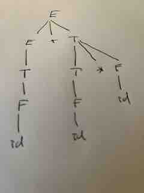

## Context Free Grammars
A **context free grammar** $G$ defines a set of strings $L(G)$ in $\Sigma^*$ where $\Sigma$ is the set of terminals for the Language.
The language is defined by a start symbol $S$ and a set of rewrite rules, called productions, of the form:

$N -> \alpha$

where $N$ is a symbol from the set ${\cal N}$ of non-terminals, and $\alpha$ is a string of nonterminals and terminals, possibly empty.

For example, here is a grammar with 9 productions defining simple arithmetic expressions:

```
1 E -> E+T
2 E -> E-T
3 E -> T
4 T -> T*F
5 T -> T/F
6 T -> F
7 F -> id
8 F -> num
9 F -> (E)
```
where id,num,(, and ). are the terminals and E,T,F are the nonterminals, and E is the start symbol.
The grammar rules are designed so that the arithmetic operators are right associative (i.e. a+b+c is parsed as (a+b)+c)
and that mult and div have higher precedences that add and sub (i.e. a*b+c/d is parsed as (a*b)+(c/d) )

## Derivations
Given a grammar G, we can define a **derivation** to be a sequence of strings  of terminal and nonterminals (ie. in $({\cal N}\cup\Sigma)^*$)
where each string is obtained from the previous one by replacing one of the nonterminals $N$ by the right hand side of a production $N -> \alpha$
in the grammar. The strings that are generated during a derivation are called **sentential forms**.

For example, here is a leftmost derivation of id + id * id
```
E -> E + T          rule 1  
  -> T + T          rule 3
  -> F + T          rule 6
  -> id + T         rule 7
  -> id + T * F     rule 4
  -> id + F * F     rule 6
  -> id + id * F    rule 7
  -> id + id * id   rule 7
```
This is called a **leftmost derivation** because at each step we replace the leftmost non-terminal with the right hand side of a production.
We can likewise define rightmost derivations, and some derivations are neither leftmost nor rightmost.

Given a derivation of a string $\sigma$ from the grammar, we can construct a **parse tree** whose root is the start symbol $S$
and the non-leaf nodes are all non-terminals, and the children of any node $N$ are given by the production used to rewrite that node
in the derivation. Here is the parse tree for the derivation above:



If $G$ is a context free grammar, we let $L(G)$ denote the set of all strings of terminals that can be derived from $G$.  Not every set of strings is context free. For example

$$L0 = \\{a^n b^n c^n | n\in {\mathtt N}\\}$$

can not be generated by a context free grammar.

## Ambiguous Grammars
If a string has two different parse trees for a particular grammar, we say the grammar is **ambiguous**. For compiling programming languages,
we do not want to have ambiguous grammars because we will use the parse tree to generate the assembly language, and we would like the 
result of the compilation to depend on the program itself and not the particular parse tree we use.

Here is an ambiguous grammar
```
E -> E+E
E -> id
E -> num
```
Show that the string ```id + id + id``` has two different parse trees, which is what it means for the grammar to be ambiguous.

Some languages are "inherently ambiguous" in the sense that any context free grammar for the language must be ambiguous. For example

$$L1 = \\{a^i b^j c^k | i=j or j=k\\}$$

is inherently ambiguous.

## Context Sensitive Grammars
We can also study context sensitive grammars, which are like CFGs except that the right hand side can have terminals and nonterminals, e.g.
```
S -> XabSY
S -> ab
Xab -> aXb
Xba -> aXb
Xaa -> aaX
Xbb -> bbX
XY -> epsilon
```
This grammar generates $\\{a^nb^n\\}$ by first generating $X(ab)^nY$ then moving X from left to right and sorting the a's and b's.
You can generalize this to get a context sensitive grammar for $L0$ above (and for $L1$). In fact, any set of strings which can be
generated by a program in a high level language, can also be generated by a context sensitive grammar! 
[So it is a very powerful construct](https://www.corsi.univr.it/documenti/OccorrenzaIns/matdid/matdid630679.pdf)


```

