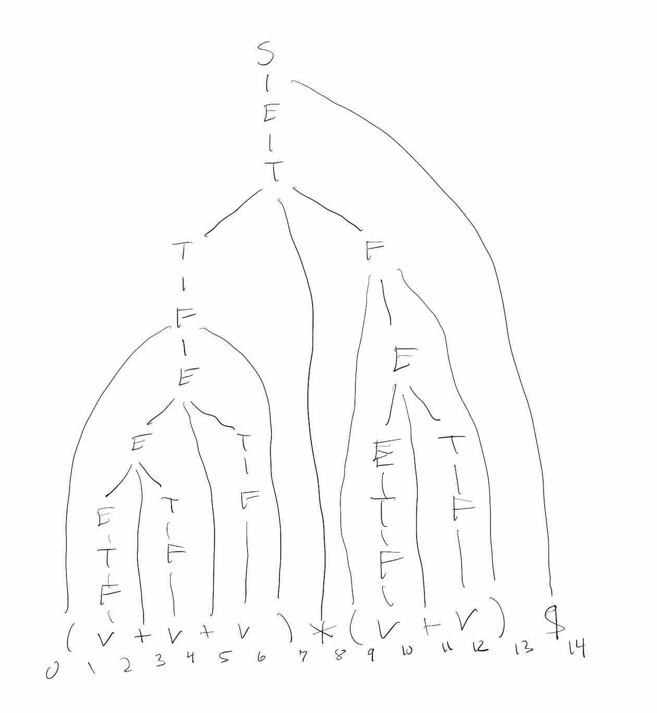

# Intro to LR Parsing
LR parsing is a shift-reduce parser which generates the parsing tree from the bottom to the top
as opposed to LL parsing which generates the parse tree from the top to the bottom.

## LR(0) items
The key concept underlying LR parsing is the notion of an LR-item which consists of a grammar rule
with a "dot" added to the right hand side

$$A \rightarrow \alpha . \beta$$

It corresponds to a derivation with root A where the symbols in $\alpha$ have been expanded to terminals.
Either or both of $\alpha$ and $\beta$ can be empty (i.e. $\epsilon$)

Consider the following left-recursive unambiguous grammar for arithmetic expressions
```
S -> E $
E -> E + T
E -> T
T -> T * F
T -> F
F -> v
F -> (E)
```
Below is a parse tree for the string "(v+v+v)*(v+v)$"


At each position of the string (from 0 before the first character to 13 after the last character)
we can associate a set of LR items for that parse tree. We will show how to generate these sets of LR items
even when we've only seen the a prefix of the string!

We will let $N_i$ be the set of LR(0)-items at position i.
We will also attach to each item $A\rightarrow \alpha . \beta$ the index of the string at which $\alpha$ starts.

```
N0 =
S -> . E $     0
E -> . T       0
T -> . T + F   0
T -> . F       0
F -> . ( E )   0
```
These correspond to the first five steps of a top-down leftmost derivation of the string
``` 
S -> E$ -> T$ -> T+F$ -> F+F$ => (E)+F$
```
After we see the left parenthesis '(' we go to state N1 which is the set of LR-items active at the beginning of the parse
```
N1 =
F -> ( . E )  0
E -> . E + T  1
E -> . T      1
T -> . F      1
F -> . V      1
```
After seeing the v we can reduce v to F and to T and to E and get
```
N2 =
F -> v .      1
T -> F .      1
E -> T .      1
E -> E . + T  1
```
Next we see the + and advance to state N3
```
N3 =
E -> E + . T  1
T -> . F      3
F -> . v      3
```
after we see the v at position 3 we go to N4
```
E -> E + T .  1
E -> E . + T  1
```
Observe that the first item ``` E -> E + T .  1```
indicates that we were looking for a E at node 1 in the rule ```E -> . E + T  1```
and since we've found that E we can advance the dot over the E to get
```E-> E . + T  1```

Try to calculate all of the rest of these node sets...
You can do it out of order, for example
```
N8 =
T -> T * . F  0
F -> . ( E )  8
```
The idea behind LR parsing is to generate LR sets by using two operations
* shift - when we move from N(i) to N(i+1) by scanning a terminal $t$ we
  find each LR item in N(i) which was expecting a "t", i.e. of the form
* $A\rightarrow \alpha . t \beta,   j$
* and advance the dot past t and put this new rule in N(i+1)
* $A\rightarrow \alpha t . \beta,   j$


